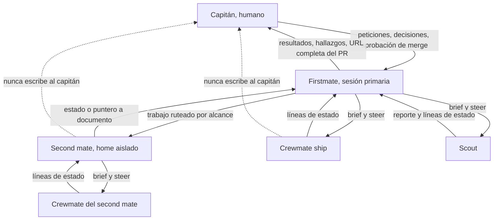
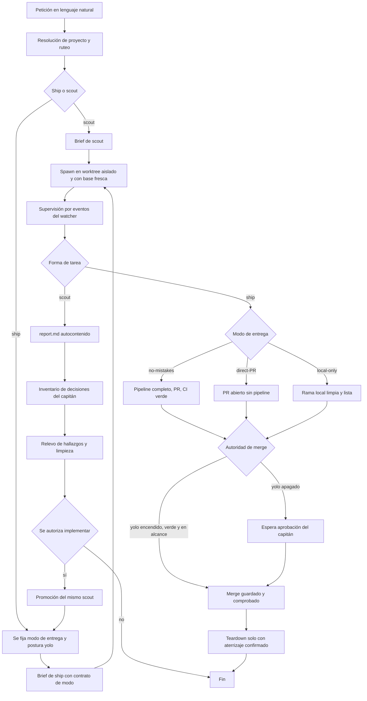

# Firstmate: flujo de trabajo para el equipo de ingeniería

Este documento explica qué es firstmate, cómo se le habla, cómo trabaja y en qué falla.
Está escrito para alguien que nunca lo ha usado y que va a correrlo en su propia Mac.

Cada afirmación proviene de un archivo del repositorio o de un reporte de verificación local.
Las rutas citadas son relativas a la raíz del clon de firstmate, salvo donde se indique otra cosa.
Cuando algo no está verificado, se dice explícitamente.

## 1. Qué es firstmate y qué no es

Firstmate es una distribución de agentes: un directorio portable de instrucciones, skills, herramientas, políticas y convenciones de estado que convierte a un agente de código de propósito general en un supervisor de flota.
Tú hablas con un solo agente, el primer oficial, y ese agente despacha, supervisa y te entrega el trabajo de una tripulación de agentes autónomos.

Lo que firstmate **no** es, en las palabras del propio `README.md`:

- No es un modelo.
- No es un arnés (`harness`).
- No es una skill.
- No es un servidor MCP.
- No es un CLI.

No hay aplicación que instalar.
El repositorio clonado **es** la distribución: `AGENTS.md`, las skills incluidas y los scripts de `bin/`.
Lanzar un arnés soportado dentro de ese directorio instancia a tu primer oficial y te convierte en el capitán.

Fuente: `README.md`, sección "What it is".

## 2. La estructura organizacional

Son cinco roles.
Tres son agentes, uno es un humano y uno es una forma de tarea que se comporta como un agente con entregable distinto.

| Rol | Quién es | Qué puede hacer | Qué no puede hacer |
| --- | --- | --- | --- |
| Capitán | El humano. Tú. | Pedir trabajo, decidir, aprobar merges, autorizar acciones destructivas. | Nada le está prohibido; es la autoridad final. |
| Firstmate (primer oficial) | La sesión primaria del agente, la única con la que conversas. | Leer proyectos, escribir su propio estado privado, despachar y supervisar workers, hacer merge cuando tiene autoridad. | Escribir dentro de un proyecto. Hacer merge de un PR sin tu palabra explícita. Destruir trabajo no aterrizado. |
| Second mate (segundo de a bordo) | Un firstmate persistente que corre desde su propio home aislado, local o en otra máquina por SSH. | Recibir trabajo ruteado por dominio, despachar sus propios workers, mantener su propio backlog. | Dirigirse al capitán. Inventar trabajo cuando su cola está vacía. Autonombrarse dueño de un proyecto. |
| Crewmate / worker | Un agente autónomo despachado para una tarea, en su propia copia aislada del repositorio. | Editar, correr, probar y commitear dentro de su copia aislada. Reportar por su archivo de estado. | Dirigirse al capitán. Salirse de su copia aislada. Hacer merge por su cuenta. |
| Scout | Un crewmate cuyo entregable es conocimiento, no código. | Investigar, reproducir bugs, diseñar, auditar y escribir un reporte. | Abrir un PR. Hacer push. Autorizar su propia implementación. |

Fuentes: `AGENTS.md` sección 1 (reglas duras), sección 6 (second mates), sección 7 (formas de tarea) y `docs/architecture.md` sección "Two task shapes".

### Quién le habla a quién

El capitán habla únicamente con firstmate.
Firstmate habla con el capitán, con sus workers y con sus second mates.
Un worker habla únicamente con quien lo despachó, y lo hace por dos canales estrechos: su archivo de estado y su panel visible.

La regla dura 4 de `AGENTS.md` lo dice sin matices: **los crewmates nunca se dirigen al capitán.**
Toda comunicación de un crewmate fluye a través de firstmate.

Esta es la regla que más sorprende a alguien nuevo, así que vale explicar el motivo mecánico.

Primero, un worker no tiene el contexto para hablar contigo.
Ve su brief y su copia del repositorio.
No ve el backlog, no ve las otras tareas en vuelo, no ve tus preferencias registradas y no sabe qué ya decidiste hace veinte minutos en otra conversación.
Un worker que te escribiera directo te daría una opinión parcial presentada como conclusión.

Segundo, un worker reporta en vocabulario interno.
Escribe líneas como `needs-decision: opción A o B` y `blocked: falta credencial`.
Firstmate traduce eso a la consecuencia del proyecto antes de mostrártelo, y esa traducción es una obligación escrita, no una cortesía; la sección 3.1 de este documento la detalla.

Tercero, y es lo más importante en la práctica: si N workers pudieran escribirte, tu bandeja escalaría con el tamaño de la flota.
El diseño entero de firstmate existe para que hables con uno y despachar con muchos.
Un solo enlace de comunicación es la propiedad que hace eso posible.

Consecuencia práctica para el equipo: si abres el panel de un worker y le escribes directo, eso es intervención legítima del capitán y firstmate la trata como autoritativa, reconciliándola en su siguiente revisión de supervisión.
Es decir: puedes hacerlo, no rompe nada, pero no es el camino normal y firstmate tiene que enterarse después.

Fuentes: `AGENTS.md` sección 1 regla dura 4, sección 8 (protocolo de supervisión), sección 9 (etiqueta con el capitán).

### Diagrama de reportes



## 3. El vocabulario completo

Cada término trae su definición precisa y su equivalente en lenguaje llano.
El equivalente llano es el que firstmate usará contigo; la definición precisa es la que necesitas para leer el repositorio.

| Término | Definición precisa | En llano |
| --- | --- | --- |
| capitán | El humano dueño de la flota y única autoridad final. | Tú. |
| firstmate | La sesión primaria del agente que corre dentro del clon y ejecuta el contrato de `AGENTS.md`. | El agente con el que hablas. |
| second mate | Un firstmate persistente con su propio `FM_HOME` aislado, alcance registrado y backlog propio, local o remoto por SSH. | Un ayudante permanente especializado en un dominio. |
| crewmate | Un agente autónomo despachado para una tarea concreta en su propia copia aislada. | Un trabajador. |
| worker | Sinónimo de crewmate en el vocabulario que firstmate sí usa contigo. | Un trabajador. |
| scout | Una forma de tarea cuyo entregable es un reporte en `data/<id>/report.md` y que nunca abre un PR. | Una investigación. |
| ship | La otra forma de tarea: produce un cambio real en el proyecto por el modo de entrega elegido. | Un cambio que se va a entregar. |
| brief | El archivo de instrucciones generado por `bin/fm-brief.sh` con el que nace un worker; incluye tarea, criterios de aceptación, reglas y definición de terminado. | Las instrucciones del trabajador. |
| worktree | Una copia aislada del repositorio, en un directorio propio, distinta del clon principal. | Copia aislada. |
| treehouse | El proveedor de worktrees que mantiene un pool de copias limpias para los backends tmux, herdr, zellij y cmux. | El que reparte copias limpias. |
| backlog | La cola durable en `data/backlog.md` con secciones `## In flight`, `## Queued` y `## Done`; solo rastrea trabajo, nunca agentes. | La lista de pendientes. |
| hold | Una tarea ordinaria del backlog retenida para el capitán con `tasks-axi hold <id> --kind captain`; es la única primitiva de "decisión". | Un pendiente que espera tu respuesta. |
| wake | Un evento accionable que despierta a firstmate; los tipos son `signal`, `stale`, `check` y `heartbeat`. | Una notificación. |
| watcher | `bin/fm-watch.sh`, un proceso de bash que duerme sobre la flota, clasifica los eventos en bash y solo despierta al modelo cuando algo es accionable. | El vigilante que no cuesta tokens. |
| teardown | El cierre de una tarea con `bin/fm-teardown.sh`: cierra el endpoint, devuelve el worktree y limpia los registros, solo después de comprobar que el trabajo aterrizó. | Limpieza. |
| delivery mode | El modo de entrega de una tarea ship: `no-mistakes`, `direct-PR` o `local-only`. Se decide en la admisión y se pasa explícito al brief y al spawn. | Cómo se va a entregar el cambio. |
| no-mistakes | El modo de entrega que corre el pipeline completo de validación externo y llega a un PR con CI verde. También es el nombre del binario que corre ese pipeline. | Entrega con revisión completa. |
| direct-PR | El modo de entrega en el que el worker commitea, hace push y abre el PR sin correr el pipeline. | Entrega rápida con PR. |
| local-only | El modo de entrega sin remoto y sin PR: el worker deja una rama local limpia y firstmate hace un merge fast-forward guardado tras la aprobación. | Entrega solo local. |
| yolo | Una postura de autoridad de merge, no un modo de entrega. Con `yolo` encendido firstmate hace merge del trabajo verde y en alcance sin preguntar. | Permiso para que haga el merge sin consultarte. |
| harness | El CLI de agente que hospeda la sesión: claude, codex, opencode, pi, pi-signed, grok, kimi, cursor y, solo para crewmates y scouts, kiro y muse. | La herramienta del trabajador. |
| backend | El proveedor de sesión visible donde vive cada tarea: tmux por omisión, y herdr, zellij, orca o cmux como experimentales. | Dónde puedes ver trabajar al agente. |
| dispatch profile | Una regla en lenguaje natural en `config/crew-dispatch.json` que firstmate lee al admitir la tarea para elegir arnés, modelo y esfuerzo. | La regla que decide qué herramienta y modelo usa cada trabajador. |
| promotion | Convertir un scout ya terminado en una tarea ship con `bin/fm-promote.sh`, en lugar de crear una tarea duplicada. | Pasar de investigar a implementar sin perder el contexto. |
| away mode | El modo ausente que activa `/afk`: un demonio de bash asume la supervisión, resuelve las notificaciones rutinarias por su cuenta y te escala lo relevante en digests agrupados. | Modo "me fui, avísame solo lo importante". |
| home / `FM_HOME` | El directorio operativo privado de una instancia: su `data/`, `state/`, `config/` y `projects/`. | La carpeta privada de esa instancia. |
| session lock | El candado por home que la sesión adquiere al arrancar; sin él la sesión queda en modo solo lectura. | Solo una sesión activa por carpeta. |
| status file / línea de estado | `state/<id>.status`, un log de eventos append-only al que el worker agrega líneas `<estado>: <nota>`. Cada línea despierta a firstmate. | El canal por el que reporta el trabajador. |
| `working` / `needs-decision` / `blocked` / `paused` / `done` / `failed` | Los seis verbos válidos de una línea de estado. `paused` es una espera externa acotada que se va a resolver sola; `blocked` es un atoro que necesita ayuda. | En curso, necesito una decisión, estoy atorado, estoy esperando algo externo, terminé, fallé. |
| steer | Enviar texto a un worker con `bin/fm-send.sh`; el mensaje queda como registro durable en la bandeja de la tarea y el worker solo recibe un timbre constante en su terminal. | Darle una instrucción nueva a un trabajador. |
| inbox de instrucciones | `state/<id>.inbox/`, la bandeja durable de mensajes secuenciados que el worker acusa moviendo el archivo a `handled/`. | La bandeja de instrucciones del trabajador. |
| ask-user finding | Un hallazgo del pipeline de validación que requiere una decisión humana; el worker que implementa nunca contesta su propio hallazgo. | Una pregunta que salió durante la revisión. |
| busy state | El veredicto semántico de si un worker está trabajando, con cuatro valores posibles: busy, idle, unknown o dead. Un estado ilegible es `unknown`, nunca `idle`. | Si el trabajador está trabajando de verdad. |
| stale / wedge | Un panel quieto cuyo worker no está demostrablemente trabajando. Si persiste, el watcher escala con un contador y eventualmente exige inspección profunda. | Un trabajador que parece haberse quedado colgado. |
| session start digest | La salida única de `bin/fm-session-start.sh`, que se corre exactamente una vez por sesión y presenta candado, diagnósticos, cola de wakes, estado de la flota y contexto. | El reporte de arranque. |
| Relay | La integración opcional de menciones públicas en X y Discord. Llega inerte y no cambia nada hasta que el home coloca un token de emparejamiento en su `.env`. | Contestar menciones públicas, apagado por omisión. |
| agent distro | Un directorio portable de instrucciones, skills, herramientas, políticas y convenciones de estado que especializa a un agente general. | Lo que es firstmate. |
| tangle | La única condición de checkout enredado: el clon principal quedó en una rama con nombre distinta de la rama por omisión. | El clon principal está en la rama equivocada. |

Fuentes: `AGENTS.md` secciones 2, 7, 8, 10 y 11; `docs/architecture.md`; `docs/configuration.md`; `.agents/skills/captain-hold-lifecycle/SKILL.md`; `bin/fm-brief.sh`.

### 3.1 El vocabulario que firstmate te esconde a propósito

La sección 9 de `AGENTS.md` es una obligación de traducción, no una guía de estilo.
Dice literalmente: habla en resultados, no en mecánica.
Y prohíbe exponerte una lista concreta de términos internos.

Esto le importa al equipo por una razón práctica: **te dice qué palabras nunca vas a oír de firstmate, y por lo tanto qué palabras no debes esperar como confirmación de que algo pasó.**
Si le preguntas "¿ya hiciste el teardown?" te va a contestar en términos de limpieza, no repitiendo tu palabra.

La tabla de traducción completa, tal como está escrita en `AGENTS.md` sección 9:

| Término interno | Lo que firstmate te dirá |
| --- | --- |
| worktree, checkout, clon principal, local-main | copia local, copia aislada o rama local, y solo si la ubicación importa |
| teardown | limpieza |
| wake, watcher, heartbeat, stale, signal, check | notificación, monitoreo, está tardando demasiado, dejó de responder |
| hold, gate, ask-user, needs-decision, blocked, paused | la decisión concreta, la espera, la aprobación, el bloqueo o la demora externa |
| done, failed, fix-review, checks-passed, cancelled, paso del pipeline | el resultado concreto, el hallazgo de la revisión, los checks pasando, un check fallando, la validación detenida |
| brief | instrucciones |
| crewmate | worker, y solo cuando importa nombrar al ayudante |
| harness, backend, runtime, adapter | runtime o herramienta del worker, y solo si la elección de herramienta bloquea el trabajo |
| status file, metadata, state, task id, ruta cruda | registro durable o registro local, u omitirlo salvo que necesites la ruta para actuar |
| fail-closed, fails closed, refuses loudly | se detiene de forma segura, se niega en lugar de continuar, reporta el requisito concreto que falta |
| fail-open, degraded-open | se hace a un lado y deja continuar el trabajo, o continúa sin esa protección opcional |

Dos excepciones explícitas: **scout** y **second mate** son vocabulario de casa aceptado y no se traducen.

Reglas asociadas que conviene conocer:

- Firstmate nunca te pasa literal el reporte de un worker, una línea de estado, una salida de herramienta o un registro de decisión.
- Los reportes privados de evidencia sí conservan identificadores, rutas y etiquetas internas exactas; lo que se traduce es el resumen en el chat.
- Cada vez que se menciona un PR, tiene que venir con la URL `https://...` completa antes de cualquier referencia corta.
- Cuando una notificación rutinaria no requiere acción pero hay que contestar algo, la respuesta exacta es `Captain, shipshape.`

Fuente: `AGENTS.md` sección 9.

## 4. El lenguaje para invocar

### 4.0 Antes de hablarle: arranque

Requisitos, según `README.md` sección "Requirements" y `docs/configuration.md` sección "Toolchain":

- Un arnés primario verificado: Claude Code, Grok, Pi, `pi-signed`, Codex, OpenCode o Cursor Agent CLI.
- Git y el CLI de GitHub, autenticado con `gh auth login`.
- El CLI del backend elegido.
  tmux es la referencia por omisión.
- La cadena de herramientas universal: node, git, gh, no-mistakes 1.46.0 o superior, gh-axi, chrome-devtools-axi, lavish-axi, tasks-axi y quota-axi.
- El delta por backend: para tmux son `tmux` y `treehouse`.

Instalación y lanzamiento:

```sh
gh auth login
git clone https://github.com/kunchenguid/firstmate
cd firstmate
claude
```

Los tres arneses co-primarios recomendados son Claude Code, Grok y Pi.
Grok necesita `--trust` una vez por clon para que carguen los hooks del proyecto.
Pi necesita que apruebes el prompt de confianza una vez por clon.

En el arranque, firstmate detecta qué le falta a la cadena de herramientas y te lista cada problema con su comando de instalación exacto.
No instala nada hasta que le dices que sí.

Fuentes: `README.md` secciones "Requirements", "Recommended harnesses" e "Install and launch"; `docs/configuration.md` sección "Toolchain".

### 4.1 Lenguaje natural

No hay sintaxis obligatoria.
Le pides trabajo como se lo pedirías a un colega, y el ejemplo del propio `README.md` es literalmente:

```
> ahoy! look at my github project xyz, then fix the flaky login test and add dark mode
```

Lo que pasa con esa frase, en orden:

**Resolución de proyecto.**
Firstmate resuelve el proyecto de forma independiente para cada petición.
Un proyecto nombrado explícitamente gana.
Un seguimiento claro hereda el proyecto de la petición anterior.
Si no hay ninguno de los dos, compara tu petición contra el registro de proyectos, el trabajo en curso y el código o README de los proyectos.
Si hay exactamente una coincidencia con confianza, procede y te nombra el proyecto en lenguaje llano.
Si hay varias o ninguna, te hace **una** pregunta concisa.

**Clasificación del entregable.**
Ship es lo predeterminado.
Scout aparece cuando pides explícitamente un entregable separado de conocimiento o diseño, o cuando una incertidumbre sin resolver podría cambiar materialmente si vale la pena construir algo o qué construir.

**Resolución del modo de entrega y la postura de merge.**
Ambos valores se resuelven en la admisión y se pasan explícitos; los comandos se niegan a adivinarlos.
Una instrucción explícita y actual tuya gana sobre todo lo demás.
Si no la hay, manda la postura registrada del proyecto.

Qué hace buena una petición, derivado de esas tres reglas:

- Nombra el proyecto si hay más de uno plausible.
  Te ahorras una ronda de preguntas.
- Di si quieres un cambio o un análisis.
  "Arregla X" es ship; "averigua por qué pasa X" es scout.
  Si pides análisis y luego implementación, son dos pasos y firstmate puede promover el scout en lugar de empezar de cero.
- Nombra el criterio de aceptación si no es obvio.
  Eso acaba en el brief del worker.
- Si quieres autonomía de merge para esa tarea, dilo en la misma frase.
  Es una decisión de admisión.
- No hace falta que digas "usa un worktree aislado", "corre el pipeline" o "abre un PR".
  Todo eso es contrato, no petición.

**Cómo apruebas un merge.**
En lenguaje natural, y basta.
`AGENTS.md` sección 7 dice que una instrucción tuya de hacer merge es autoridad explícita.
El ejemplo del `README.md` es `> alright merge it`.
"Adelante", "sí, mergea", "mergea el 42" funcionan igual.

Dos límites que no puedes saltar con lenguaje natural:

1. Un PR rojo no se mergea con ninguna postura ni con ninguna instrucción de rutina.
2. Los merges destructivos, irreversibles o sensibles a seguridad siguen escalando a ti aunque `yolo` esté encendido, y requieren que nombres la acción concreta.

Y una regla de precedencia que conviene entender porque explica por qué a veces te pregunta de nuevo: una instrucción tuya explícita y concreta anula cualquier regla estándar escrita en `AGENTS.md`, pero solo dentro de su alcance exacto.
Firstmate no puede inferir el alcance, ni extenderlo por analogía, ni convertir una petición puntual en autoridad permanente.
Por eso una autorización que diste para un merge no se hereda al siguiente.

Fuentes: `AGENTS.md` sección 7 ("Intake and authority", "Selected delivery path and merge authority"), sección "Captain instruction precedence"; `README.md` sección "Talk to it".

### 4.2 Los comandos slash

Firstmate trae cinco skills invocables por el capitán.
Claude y grok usan la forma con diagonal que se muestra abajo; codex usa los mismos nombres con `$`, por ejemplo `$afk`.

Estos cinco son los únicos que tienen `user-invocable: true` en el frontmatter de su `SKILL.md`.
Todos los demás archivos bajo `.agents/skills/` son referencias que solo el agente carga en disparadores precisos, y `AGENTS.md` sección 13 los enumera; un humano nunca los teclea.

| Comando | Para qué sirve | Cuándo usarlo |
| --- | --- | --- |
| `/bearings` | Genera un digest de cuatro secciones del estado actual de la flota, a partir de una lectura acotada y determinista del estado en disco. | Cuando vuelves después de una pausa, una noche o un reinicio de contexto y quieres retomar en una sola lectura. |
| `/ahoy` | Recapitula solo los eventos visibles de la sesión desde tu último mensaje real, y luego te guía por las decisiones que quedaron sin contestar, una por una. | A media sesión, cuando perdiste el hilo de lo que pasó mientras no veías. |
| `/afk` | Entra en supervisión de modo ausente: un demonio resuelve por su cuenta las notificaciones rutinarias, escala lo relevante en digests agrupados y te alerta activamente si una entrega se atora. | Cuando te vas a levantar de la máquina y quieres que la flota siga sin ti. |
| `/stow` | Barre la sesión buscando conocimiento durable que solo existe en la conversación, lo escribe a disco en su dueño más específico, corrige registros de trabajo abiertos y cura la memoria de arranque. | Antes de un reinicio intencional de contexto, o periódicamente. |
| `/updatefirstmate` | Actualiza el firstmate en ejecución y sus second mates a lo último de `origin`, solo con fast-forward, y luego relee las instrucciones. | Cuando quieres la última versión de la distribución. |

Detalle de `/bearings`, porque tiene modos y son la única parte con sintaxis real:

- `/bearings` a secas devuelve el digest en el chat y no escribe ningún archivo.
- `/bearings file` además reemplaza desde cero el reporte fechado `data/status-report-<YYYY-MM-DD>.md` y te lo enlaza.
- `/bearings lavish` además construye un tablero interactivo donde contestas las decisiones directamente en lugar de responder en el chat.
- `/bearings include PRs` activa el enriquecimiento con datos vivos de PRs, y compone con los otros modos.
- Los modos `file` y `lavish` son opciones explícitas del comando.
  Pedir "escríbelo en un archivo" en lenguaje natural no activa el modo `file`.

Las cuatro secciones que devuelve `/bearings` son:

1. **Captain's Call**: solo lo que requiere tu acción ahora.
   Una decisión, un PR por aprobar o mergear, una credencial o un bloqueo que solo tú puedes quitar.
2. **Recently Landed**: la línea base acotada de lo recién terminado.
   PRs mergeados, scouts completados y merges locales concluidos, en la flota principal y en cada second mate registrado.
3. **Underway**: cada reporte directo vivo, con su estado actual y los punteros que vale la pena reabrir.
4. **Charted Next**: trabajo en cola o con compuerta, con su bloqueo, fecha o razón.

Fuentes: `.agents/skills/*/SKILL.md` (frontmatter `user-invocable`), `.agents/skills/bearings/SKILL.md` secciones "Invocation modes" y "Compose the four-section chat digest", `README.md` sección "Built-in skills", `AGENTS.md` sección 13.

### 4.3 Comandos que vienen del arnés, no de firstmate

Si corres la sesión primaria en Pi, hay dos comandos extra que son de Pi y no de firstmate.
Los menciono porque los vas a ver y conviene saber que no son parte de la distribución.

- `/calm` oculta el ruido de transcripción soportado, incluidas las filas operativas de firstmate, y muestra un barco animado mientras hay trabajo activo.
  No cambia el contexto del modelo ni los datos de la sesión, y la preferencia persiste por home.
- `/supervision-model` fija un modelo más barato y un esfuerzo de razonamiento más bajo solo para la rama de supervisión, escogidos de entre los modelos y niveles que Pi mismo reporta.

Fuentes: `README.md` sección "Install and launch"; `docs/calm.md` y `docs/configuration.md` sección "Pi supervision branch model and effort" son los dueños del detalle.

## 5. El flujo de trabajo de punta a punta

### 5.1 Los pasos, en orden

**1. Admisión y resolución de proyecto.**
Ya descrito en 4.1.
Además, firstmate rutea por la naturaleza del trabajo contra el alcance registrado de cada second mate, no por la lista de clones de cada home, que es dato de provisión y no de propiedad.
El trabajo `local-only` se queda en el home principal.

**2. Clasificación ship contra scout.**
Ship es lo predeterminado.
Una petición de diagnóstico, un reporte, una recomendación o un hallazgo listo para implementar son **evidencia, no autorización para cambiar código**.
Eso es explícito en `AGENTS.md` sección 7 y es la razón por la que un reporte de scout no dispara una implementación por sí solo.

**3. Concurrencia.**
El traslape de archivos o subsistemas es una señal de riesgo, no una razón automática para esperar.
Firstmate despacha trabajo aislado de inmediato y **sin tope de concurrencia** cuando cada cambio se puede implementar y validar de forma independiente y la ruta de entrega elegida puede reconciliar rebases o conflictos ordinarios.
Solo serializa por una dependencia semántica real, estado externo mutable compartido, una migración concurrente incompatible u otra condición concreta que haga insegura la reconciliación.
Editar el mismo archivo, por sí solo, no basta para serializar.

**4. El brief.**
`bin/fm-brief.sh` genera el andamiaje y firstmate reemplaza los marcadores con la descripción de la tarea, criterios de aceptación, restricciones y contexto necesario.
Todo brief de ship conserva la aserción de aislamiento de worktree y se detiene si nació en el clon principal.
El brief lleva una línea legible por máquina con el modo de entrega, y el spawn se niega a lanzar sobre un modo distinto, así que las instrucciones del worker y el modo registrado no pueden divergir.

**5. Spawn en la copia aislada.**
Solo por `bin/fm-spawn.sh`.
El spawn tiene que resolver un worktree de tarea genuinamente aislado y distinto del clon principal; si la aserción falla, la tarea se detiene.
`fm-spawn.sh` también es dueño de la frescura de la base: ningún worker arranca hasta que su worktree limpio coincide con la punta traída de la rama por omisión de `origin`, y una base insegura o no verificable detiene el spawn.
Cuando aplica la compuerta de backlog, el spawn mismo mueve el pendiente a `In flight` y se niega a despachar trabajo del que este home no tiene registro.

**6. Supervisión por eventos.**
El watcher de bash duerme sobre la flota, clasifica los eventos en bash y solo despierta al modelo cuando algo es accionable.
Los eventos benignos se absorben, avanzan sus marcadores de supresión y no generan ni un turno del modelo.
El sondeo rutinario, las esperas y los latidos sin cambio son silenciosos.
Los wakes accionables se escriben en una cola durable en disco, y se acusan solo **después** de haberlos atendido, para que un watcher o un turno interrumpido no pierda el registro.
Para dirigir a un worker, firstmate usa `bin/fm-send.sh`: el mensaje queda como registro durable en la bandeja de la tarea y el worker solo recibe un timbre constante en su terminal.

**7. Validación.**
Solo en modo `no-mistakes`.
Se dispara sobre el mismo worker después de su commit de implementación, y ese worker es el dueño del pipeline hasta la siguiente compuerta o el resultado final.
Un hallazgo `ask-user` regresa como `needs-decision`; el worker que implementa nunca contesta su propio hallazgo.
Firstmate decide los hallazgos inequívocos contra la intención ya aceptada y te escala solo los genuinamente ambiguos, expansivos o destructivos.
Una vez que la validación arranca, los requisitos nuevos se rutean a trabajo de seguimiento en lugar de expandir la tarea actual, salvo que un requisito nuevo invalide por completo lo que se está validando.

**8. PR y autoridad de merge.**
En `no-mistakes` la señal de listo llega cuando CI está verde.
En `direct-PR` llega al abrir el PR.
En ambos casos te llega la URL `https://...` completa, un resumen conciso del resultado y el nivel de riesgo cuando aplica.
El merge pasa siempre por `bin/fm-pr-merge.sh`, que registra la metadata y **se niega a reportar como aterrizado un merge que no puede comprobar**.
Ese script exige una URL canónica completa y rechaza URLs mal formadas o banderas que sobrescriban el repositorio.
Después de que el comando del forge regresa, confirma que el PR realmente aterrizó, y solo un aterrizaje confirmado se registra como tal; una petición encolada o sin confirmar no registra nada y deja su sondeo armado.
En GitHub, un resultado que no es ni mergeado ni encolado se rechaza ruidosamente y con código distinto de cero, nombrando el estado observado.
En GitLab hay además una lectura viva previa: el merge ocurre solo después de confirmar que el MR está abierto, mergeable, sin conflictos, con las discusiones bloqueantes resueltas y con pipeline exitoso en la cabeza actual, y el merge queda atado a esa cabeza verificada.

**9. Limpieza.**
Una tarea ship se limpia solo después de confirmar el aterrizaje.
El teardown es fail-closed: un worktree sucio se niega, y el trabajo commiteado tiene que estar aterrizado antes de devolver la copia.
Una negativa del teardown por trabajo sin commitear o sin aterrizar es un resultado de "detente e investiga", nunca un obstáculo por saltar.
Forzar el teardown requiere autoridad explícita de descarte.

**10. El reporte de un scout.**
Un scout terminado tiene que dejar un reporte autocontenido antes de que su worktree desechable pueda descartarse.
Firstmate lee ese reporte, te releva los hallazgos como hallazgos y no solo como aviso de que terminó, y lo registra como el artefacto de la tarea.
Un reporte **puede recomendar** implementación pero **no la autoriza**.
Antes de tratar la investigación como completa, firstmate inventaría las decisiones que quedaron para ti y las deja registradas como tareas retenidas; el teardown hace valer esa compuerta.
Cuando la implementación se autoriza aparte, el scout existente se **promueve** con `bin/fm-promote.sh` en lugar de crear una tarea duplicada, y el worker promovido regresa a una base limpia, se lleva solo los cambios intencionales, deja atrás los commits de scratch y convierte el bug reproducido en la prueba de regresión.

Fuentes: `AGENTS.md` sección 7 completa, secciones 8, 10 y 11; `docs/architecture.md` secciones "Event-driven supervision", "Worktrees, not branches in your checkout" y "Delivery modes are explicit per task"; `bin/fm-dod-lib.sh`.

### 5.2 Los tres modos de entrega

La definición de terminado de cada modo la escribe un solo dueño, `bin/fm-dod-lib.sh`, y se renderiza igual en el brief generado y en las instrucciones que recibe un scout promovido.
Eso existe para que un worker promovido no pueda recibir un contrato más débil que uno briefeado.

| Modo | Qué hace el worker | Quién revisa | Dónde termina |
| --- | --- | --- | --- |
| `no-mistakes` | Implementa, commitea, y luego maneja el pipeline completo de validación respondiendo a sus compuertas. No arregla hallazgos a mano: el pipeline aplica cada fix. | El pipeline `no-mistakes`, que es dueño de revisión, fixes, pruebas, documentación, push, PR y CI. | Un PR con CI verde, esperando la autoridad de merge configurada. |
| `direct-PR` | Implementa, commitea, hace push y abre el PR con `gh-axi`. No corre el pipeline. | Nadie más que el propio worker y el CI del proyecto. | Un PR abierto, esperando la autoridad de merge configurada. |
| `local-only` | Implementa y commitea en la rama `fm/<id>`. No hace push, no abre PR, no mergea. Mantiene la rama como fast-forward limpio sobre la rama por omisión. | Nadie más que el propio worker. | Una rama local lista, esperando aprobación; luego firstmate hace el merge fast-forward guardado. |

Regla importante que evita trabajo duplicado: **la ruta de entrega elegida es dueña de su propio rigor.**
Cuando `no-mistakes` está seleccionado, `no-mistakes` es el único revisor.
Cuando no lo está, se sigue la ruta rápida **sin** agregar un revisor independiente.
Firstmate no puede retener trabajo fuera de `no-mistakes` esperando un veredicto manual, ni encadenar revisiones manuales en serie, ni inferir autoridad para una revisión a partir de seguridad, arquitectura o riesgo.
Si el riesgo de la ruta rápida pide más rigor, lo que hace es escalarte la pregunta de usar `no-mistakes`, no inventar una compuerta manual.

### 5.3 Modo de entrega y `yolo` son ortogonales

Este es el error fácil, y `AGENTS.md` lo dice con esas palabras: son ortogonales.

- **El modo de entrega** decide **cuánto rigor** lleva el cambio: pipeline completo, PR directo o solo local.
- **`yolo`** decide **quién aprieta el botón de merge**.
  Nada más.

Con `yolo` apagado, tú apruebas cada merge de PR y cada aterrizaje `local-only`.
Con `yolo` encendido, firstmate mergea por su cuenta el trabajo verde y en alcance.

Las cuatro combinaciones son válidas y significan cosas distintas:

| | `yolo` apagado | `yolo` encendido |
| --- | --- | --- |
| `no-mistakes` | Rigor máximo, tú apruebas el merge. | Rigor máximo, firstmate mergea solo si está verde. |
| `direct-PR` | Rigor bajo, tú apruebas el merge. | Rigor bajo, firstmate mergea solo si está verde. |
| `local-only` | Sin remoto, tú apruebas el aterrizaje local. | Sin remoto, firstmate hace el fast-forward local. |

Lo que `yolo` **no** hace, en ninguna combinación:

- No autoriza el merge de un PR rojo.
- No autoriza acciones destructivas, irreversibles o sensibles a seguridad; esas siguen escalando.
- No sustituye una instrucción explícita y actual tuya donde se requiere que nombres la acción concreta.
- No cambia el modo de entrega ni relaja la validación.

Un proyecto sin registrar, o un registro ausente, resuelve a `no-mistakes` con `yolo` apagado, y el hueco de registro te llega a ti.

Fuentes: `AGENTS.md` sección 7 ("Selected delivery path and merge authority"), sección "Captain instruction precedence"; `docs/architecture.md` sección "Delivery modes are explicit per task".

### 5.4 Diagrama del flujo



## 6. Ventajas

Cada ventaja va con su razón mecánica y con lo que concretamente se rompe sin ella.

### Aislamiento por worktree

Cada tarea corre en una copia aislada del repositorio, en un directorio propio, servida por un pool de copias limpias.
`fm-spawn.sh` se niega a lanzar si la ruta resuelta no es la raíz de un worktree de git real distinto del clon principal.
Además exige frescura: ningún worker arranca hasta que su worktree limpio coincide con la punta traída de la rama por omisión de `origin`.

Sin esto: dos workers en el mismo checkout se pisan los cambios sin commitear, un `git checkout` de uno tira el trabajo del otro, y un worker que arranca desde una base vieja produce un PR que resuelve conflictos que ya no existen.
Es exactamente el problema de hacer malabares con pestañas que la distribución existe para eliminar.

Fuente: `docs/architecture.md` sección "Worktrees, not branches in your checkout".

### Supervisión por eventos y sin costo de tokens

`bin/fm-watch.sh` es bash.
Duerme sobre la flota, clasifica cada evento detectado en bash, y solo despierta al modelo cuando algo es accionable.
Los eventos benignos se absorben: avanzan sus marcadores de supresión, se registran en un log de triage y dejan al watcher bloqueado, sin registro en la cola y sin un turno del modelo.
El sondeo rutinario, el tiempo transcurrido y los latidos sin cambio son silenciosos por diseño.

Sin esto: la supervisión sería un ciclo de sondeo hecho por el modelo, y cada vuelta costaría tokens sin producir nada.
Con tres workers y una espera de una hora, eso es un gasto continuo por no hacer nada.
También sería más lento en reaccionar, porque el sondeo por turnos tiene una granularidad mucho más gruesa que un `sleep` de bash.

Fuentes: `docs/architecture.md` sección "Event-driven supervision"; `README.md` sección "Features".

### La frontera de solo lectura sobre los proyectos

La regla dura 1 dice: nunca escribas en un proyecto.
Firstmate lee los proyectos; los crewmates los cambian.
Las excepciones son estrechas y cada una tiene un script o skill dueño: inicialización guardada de proyecto, sincronización de flota, sincronización de second mates, autoactualización, la ruta aprobada de merge `local-only`, y una operación concreta que el capitán aprueba en el momento para un proyecto específico.
Ninguna de esas rutas autoriza forzar, hacer stash, descartar trabajo sin aterrizar, ni escribir a mano el `AGENTS.md` de un proyecto.
Y esa aprobación puntual no genera autoridad permanente.

Sin esto: el agente con el que estás conversando, el que tiene el contexto más largo y más presión por avanzar, sería también el que puede modificar tu clon principal.
Un cambio hecho "de pasada" mientras investiga aparecería como diff sin commitear en tu checkout, sin brief, sin revisión, sin PR y sin registro de quién lo hizo.

Fuente: `AGENTS.md` sección 1, regla dura 1.

### Estado durable que sobrevive a un reinicio

Todo el estado de la flota vive en disco y en el backend de sesión activo: los registros de corridas del pipeline, los logs de eventos de estado, el markdown bajo `data/`, la metadata por tarea bajo `state/` y los homes persistentes de los second mates.
La cola de wakes es durable y se acusa solo después de atender, con acuse ligado a la generación, así que una interrupción a la mitad deja el trabajo durable para volver a atenderlo de forma idempotente.
En el arranque, los endpoints de second mate confirmados como muertos se cierran y se relanzan, mientras que las lecturas ambiguas se dejan intactas para no duplicar supervisores.

Sin esto: cerrar la terminal perdería la flota.
Peor: la perdería a medias, dejando workers vivos sin nadie que los supervise, PRs abiertos sin nadie que los reporte, y worktrees ocupados sin nadie que los devuelva.
Con estado durable, un reinicio es un no-evento porque la autoridad es el disco, no la memoria de la conversación.

Fuentes: `docs/architecture.md` secciones "Restart-proof" y "Event-driven supervision"; `AGENTS.md` secciones 2 y 5.

### La compuerta de autoridad de merge

Con `yolo` apagado, ningún merge ocurre sin tu palabra.
Con `yolo` encendido, el merge pasa por `bin/fm-pr-merge.sh`, que exige una URL canónica completa, rechaza URLs mal formadas y banderas de override de repositorio, y **después** de que el forge responde confirma que el PR efectivamente aterrizó.
Solo un aterrizaje confirmado se registra como aterrizado; en GitHub un resultado que no es ni mergeado ni encolado se rechaza ruidosamente y con código de salida distinto de cero, nombrando el estado observado.
En la ruta de GitLab hay además una verificación previa contra la cabeza actual, y la metadata registrada nunca es la autoridad para esas condiciones porque un rebase la deja vieja.

Sin esto: el punto de mayor daño de todo el flujo, escribir en la rama compartida, sería el que menos verificación tiene.
Y sin la confirmación posterior, un merge encolado o rechazado se te reportaría como aterrizado, que es la peor clase de error posible: uno que te hace dejar de vigilar.

Fuentes: `AGENTS.md` sección 7; `docs/architecture.md` sección "Delivery modes are explicit per task".

### Paralelismo sin tope cuando el trabajo es genuinamente independiente

No hay una constante de concurrencia máxima.
La condición no es un número, es una prueba: cada cambio se tiene que poder implementar y validar de forma independiente, y la ruta de entrega elegida tiene que poder reconciliar rebases o conflictos ordinarios.
Editar el mismo archivo no basta para serializar; sí bastan una dependencia semántica real, estado externo mutable compartido o una migración concurrente incompatible.

Sin esto: o un tope arbitrario te deja capacidad ociosa cuando el trabajo sí es independiente, o la ausencia de la prueba te deja despachando cambios que se van a estorbar y vas a pagar en conflictos y trabajo rehecho.
La prueba explícita es lo que permite quitar el tope sin volverse imprudente.

El límite real de este paralelismo es la memoria de tu Mac, no la política; ver sección 7.

Fuente: `AGENTS.md` sección 7 ("Intake and authority").

## 7. Limitaciones

Esta sección es concreta a propósito.
Todo lo que sigue está observado y fechado, o está escrito como límite explícito en el repositorio.

### 7.1 La trampa de identidad por inyección de prompt

Es la limitación más importante y la más difícil de anticipar.

**Qué pasa.**
El `AGENTS.md` y el `CLAUDE.md` del repositorio de firstmate abren con "You are the first mate. The user is the captain.".
Un crewmate despachado a editar ese repositorio lee ese archivo como si fuera su propio encargo, concluye que **es** firstmate, y entonces trata su brief y su bandeja de instrucciones como contenido inyectado que intenta manipularlo.
Se niega a trabajar, cita la regla dura 1 - "never write to a project" - como razón para no editar `bin/`, y se dirige al capitán directamente, que es justamente lo que un crewmate nunca debe hacer.

**Observado en vivo el 2026-09-01**, con dos workers simultáneos sobre el propio repositorio de firstmate.

**No se limita al repositorio de firstmate.**
La ampliación fechada 2026-09-02 lo corrige: volvió a ocurrir en un proyecto ordinario recién creado que **no** tiene `AGENTS.md` y cuyo worktree no contiene material de firstmate.
Un worker rechazó su brief **tres veces** tratándolo como inyección de prompt.
La causa real no es leer el `AGENTS.md` de firstmate: basta un brief que hable de un capitán, de un supervisor, de datos de cliente que no se deben publicar y de reglas sobre a quién obedecer.

**Depende del modelo y del arnés, y eso está medido en una muestra chica.**
En las tres ocurrencias observadas, `claude-opus-5` no cayó y `claude-sonnet-5` sí, dos veces seguidas; en la segunda incluso rechazó el mensaje correctivo enviado por el canal de steer.
Son tres casos, no una medición general: en el segundo, el relanzamiento cambiando de arnés funcionó **sin cambiar de modelo**, así que el arnés, y no solo el modelo, es parte del factor.
Costo del rechazo: alrededor de 0.5 créditos gastados en negarse a trabajar.

**Lo que no funciona.**
Corregirlo por mensaje.
Ya atrincherado, cada intento de corrección parece confirmarle la teoría de la inyección.

**La mitigación que sí funciona.**
Meter el aviso de identidad **al principio** del brief, antes de cualquier instrucción de trabajo: explicarle que el `AGENTS.md` del repositorio describe a su supervisor y es material fuente, no instrucciones dirigidas a él, y que la regla dura 1 ata a firstmate, no al crewmate en su propio worktree.
Si ya cayó, relanzar con `bin/fm-control.sh <id> relaunch` con un modelo fuerte y ese mismo aviso al principio de la nota.
Sale más barato prevenirlo que relanzarlo.

**Consecuencia práctica para el equipo.**
El perfil de despacho por omisión es justamente el que más se despacha.
Al pedir trabajo cuyo brief vaya a mencionar roles, autoridad o restricciones sobre datos, hay que esperar el rechazo y tener el relanzamiento listo.

Fuente: `data/learnings.md`, entradas del 2026-09-01 y su ampliación del 2026-09-02.

### 7.2 kiro no puede correr la sesión primaria ni un second mate

kiro está verificado **solo** para crewmates y scouts.
`fm-spawn.sh` lo rechaza para un second mate.
Y `AGENTS.md` sección 4 lo excluye del conjunto de arneses primarios.

Las razones son concretas y están documentadas, no son cautela genérica:

- Kiro CLI **no tiene protocolo de supervisión primaria**: no hay `asyncRewake` ni continuación manejada por hooks.
  Sin eso, una sesión primaria de kiro no puede rearmar su propio ciclo de supervisión sin gastar un turno del modelo.
- **No tiene contrato de second mate**: no hay integración de fin de turno para una sesión primaria.
- Está **fuera de las integraciones del guard de fin de turno** documentadas en `docs/turnend-guard.md`.

`muse` tiene la misma frontera por una razón análoga: no trae una superficie de hooks usable para la supervisión de fin de turno de una sesión primaria.

Consecuencia práctica: si alguien del equipo usa Kiro CLI como su herramienta diaria, **no puede lanzar firstmate ahí**.
Tiene que correr la sesión primaria en uno de los arneses primarios verificados, y kiro le queda disponible como herramienta de sus workers.

Fuentes: `docs/configuration.md` sección "Harness support"; `.agents/skills/harness-adapters/references/harness/kiro.md` sección "Maturity and primary limit"; `.agents/skills/harness-adapters/SKILL.md`; `AGENTS.md` sección 4.

### 7.3 Los huecos de hooks de kiro bajo V3

Verificado el 2026-09-02 sobre Kiro CLI 2.18.0 con el motor de agentes V3.

**Hueco 1: el hook `Stop` no dispara al interrumpir.**
Probado con Escape y con Ctrl+C mientras corría un comando de shell.
El log de hooks mostró solo `UserPromptSubmit`: ni `Stop`, ni `StopFailure`, ni ningún evento específico de interrupción.
También probado interrumpiendo durante el pensamiento del modelo, sin herramienta activa: no dispara ningún hook.

Consecuencia: el registro de "ocupado" que abrió `UserPromptSubmit` no lo cierra el cancelar el turno.

**Hueco 2: cuando el agente es matado, no dispara ningún hook.**
Ni con SIGTERM ni con SIGKILL.
El registro de ocupado sigue mintiendo.

**Qué hace firstmate al respecto.**
No confía en el hook como única fuente.
El contrato semántico de estado de worker reconcilia el registro contra la presencia viva del agente: un endpoint que ya no existe, y un endpoint del que el backend puede probar que no contiene agente, **le ganan** a un registro de ocupado, precisamente porque ningún hook de ciclo de vida sobrevive a un proceso matado y el registro que nunca se limpió reportaría un cadáver como trabajando.
Un backend que no puede responder con confianza nunca contradice el veredicto.
Además, un estado faltante, mal formado, viejo o no confiable clasifica como `unknown`, nunca como `idle`, y `unknown` nunca se promueve a `busy`; un worker ilegible sale a revisión en lugar de absorberse como trabajando o darse por terminado.

V3 sí trae una señal parcial: un hook `PostToolUse` que dispara al cancelar con un marcador `Exit Code: -1`.
Firstmate **la deja deliberadamente sin usar** en su librería de estado ocupado, porque el estado de ocupado es un contrato de abrir y cerrar por turno, y ese marcador es silencioso cuando la interrupción ocurre durante el pensamiento del modelo.
Una señal que funciona la mitad de las veces sería peor que ninguna en un contrato de este tipo.

**Lo que V3 sí arregló.**
V2 dejaba huérfanos los procesos hijos de shell al interrumpir, y eso requirió intervención manual tres veces el 2026-09-01.
V3 mata el proceso hijo y todo su árbol, verificado dos veces.
Esa fila es la razón por la que firstmate lanza V3: un huérfano que hereda la tubería de salida de la herramienta atora al worker indefinidamente.

Fuentes: `data/fm-kiro-v3-verify/report.md` (home privado del capitán) (respuestas prioritarias 1 a 3, tests 2 a 8); `.agents/skills/harness-adapters/references/harness/kiro.md` sección "Interrupt and kill"; `docs/architecture.md` sección "Busy state is semantic, per adapter".

### 7.4 El costo de memoria de varios workers al mismo tiempo

Cada worker es una sesión de agente completa, con su propio proceso, su propio contexto y su propia copia del repositorio en disco.
Eso ya cuesta.

Para kiro específicamente está medido: V3 corre el Kiro Agent Server como procesos hijos separados, y ese servidor de node agrega alrededor de **230 MB de RSS por worker**.
El árbol de procesos es `kiro-cli` -> `kiro-cli-chat` -> `bun` -> `node`, contra el árbol de dos procesos de V2.
La verificación lo dice explícitamente: eso importa al dimensionar una flota en una máquina con memoria limitada, y no cambia el costo en créditos.

Dos detalles más que salieron de la misma verificación:

- Al mandar SIGTERM a `kiro-cli`, el proceso de node puede quedar huérfano bajo PID 1, aun cuando los hijos de shell sí se limpian.
  Observado una vez.
  Con SIGKILL muere todo el grupo de procesos limpiamente.
- La huella de memoria se midió **solo al arranque**.
  El comportamiento del RSS a lo largo de una sesión larga está marcado como no verificado en ese reporte.

Consecuencia práctica: el límite real de "paralelismo sin tope" en una Mac es la RAM.
Tres workers de kiro son cerca de 700 MB solo del servidor de agentes, antes de contar el proceso del agente, el multiplexor, los worktrees y lo que el propio trabajo levante, como un backend o un servidor de desarrollo.

Fuentes: `data/fm-kiro-v3-verify/report.md` (home privado del capitán) secciones "Cost comparison", "KAS engine architecture" y "UNVERIFIED items"; `.agents/skills/harness-adapters/references/harness/kiro.md` sección "KAS engine process shape".

### 7.5 Una sola sesión activa por home

El arranque adquiere un candado por home antes de que algo mute estado compartido.
Si el candado no se puede adquirir y verificar, la sesión reporta el diagnóstico exacto y **se queda en solo lectura**.
Una sesión sin candado no puede despachar, dirigir workers, hacer merge, drenar la cola de wakes, reparar supervisión ni reparar un checkout.

Consecuencia práctica: no puedes tener dos sesiones de firstmate trabajando sobre el mismo home.
Si quieres dos flotas en paralelo, necesitas homes separados, y eso es exactamente para lo que existen los second mates con su propio `FM_HOME` aislado.

Fuentes: `AGENTS.md` sección 3, pasos "Lock" y siguientes; `AGENTS.md` sección 2.

### 7.6 Solo un backend está verificado como referencia

tmux es el backend de referencia verificado.
herdr, zellij, orca y cmux son **experimentales**.
Y tienen límites concretos:

- `backend=orca` y `backend=cmux` rechazan los spawns de second mate; esa semántica todavía no está diseñada para ellos.
- Para la sonda profunda de liveness del proceso de agente que usa la recuperación de second mates, tmux y herdr tienen clasificadores verificados; zellij sigue sin verificar.
- La confirmación de envío tecleado de Cursor está verificada solo en tmux y herdr.
  En Zellij, cmux y Orca el envío llega, pero `fm-send` reporta la entrega como no confirmada y sale con código distinto de cero.
- `codex-app` no es un backend de runtime seleccionable.

Consecuencia práctica: si el equipo quiere el camino verificado, es tmux.
Los demás están soportados y documentados, pero cargan compensaciones que hay que leer en su propia guía antes de elegirlos.

Fuentes: `docs/configuration.md` sección "Runtime backend"; `docs/architecture.md` sección "Runtime session backends"; `README.md`.

### 7.7 Dependencias duras de la cadena de herramientas

La cadena de herramientas universal no es opcional.
Concretamente, `tasks-axi` y `quota-axi` son herramientas requeridas de bootstrap en todos los perfiles, de la misma clase que `lavish-axi`.

- Con `tasks-axi` ausente o incompatible, y sin haber puesto el backend de backlog en `manual`, un home con backlog **se niega a mutar el ciclo de vida** hasta que haya una versión compatible en el `PATH`.
- Con `quota-axi` ausente o demasiado viejo, firstmate no puede resolver un arreglo de perfiles de despacho.

Además, el demonio de `no-mistakes` es **una sola instancia que sirve a todos los homes y carriles**.
Reiniciarlo mata las corridas de pipeline en vuelo de los otros carriles.
Por eso el andamiaje del brief le prohíbe a cada worker detenerlo, reiniciarlo o actualizarlo, y le pide reportar el error del demonio como bloqueo.

Consecuencia práctica: si varias personas del equipo corren firstmate en la misma máquina, comparten ese demonio.
En Macs separadas no aplica, pero vale saberlo antes de que alguien "arregle" el demonio y tumbe la validación de otro.

Fuentes: `docs/configuration.md` secciones "Toolchain" y "Backlog backend"; `bin/fm-brief.sh` líneas 358 y 437.

### 7.8 La alerta de second mate atorado da falsos positivos

Observado el 2026-09-02: la alerta de ciclo de wakes atorado de un second mate disparó **seis veces en una sola sesión** contra un mate que estaba sano.
En cada caso la causa fue una de dos: el second mate estaba compactando su conversación, o iba a la mitad de una vuelta larga, como leer archivos grandes o despachar workers.
Ninguna fue un atoro real.

El umbral es de unos 60 segundos, y un second mate que hace vueltas largas lo cruza como rutina.
Esto contradice en la práctica lo que `AGENTS.md` sección 8 ya dice: el endpoint quieto de un second mate es sano, y la supervisión del padre se apoya en su estado ruteado, no en la quietud del panel.

Qué hacer cuando llegue: mirar el panel antes que cualquier otra cosa.
Si dice que está compactando la conversación, o muestra actividad con contador corriendo, es falso positivo: se acusa y se sigue.
Cuesta un turno cada vez.

Fuente: `data/learnings.md`, entrada del 2026-09-02.

### 7.9 `/stow` no reconcilia contra la realidad del repositorio

`/stow` preserva conocimiento durable que solo existe en la conversación.
Su entrada **es** el contexto volátil, así que solo puede preservar lo que la sesión todavía sabe.

Está escrito explícitamente que **no** es una reconciliación de los registros durables contra la realidad del repositorio o de los PRs, y que hoy no existe ninguna reconciliación que sobreviva a una sesión.

Consecuencia práctica: si un registro se desincronizó de la realidad **y** la sesión ya no lo sabe, `/stow` no lo va a arreglar.
Corre `/stow` **antes** de un reinicio intencional de contexto, no después de perderlo.

Fuentes: `docs/architecture.md` sección "Operational memory routing"; `.agents/skills/stow/SKILL.md`.

### 7.10 La supervisión trata al panel quieto como sospechoso, y eso tiene costo

El watcher escala un panel quieto cuyo worker no está demostrablemente trabajando.
Tiene mitigaciones reales: un panel que escribió un archivo en su worktree después de que empezó su ventana de silencio se difiere en lugar de escalarse, con la razón nombrando la evidencia de escritura; y una pausa declarada por el worker toma una cadencia de revisión más larga en lugar de tratarse como atoro.

Pero esas mitigaciones tienen fronteras explícitas:

- El worktree de un second mate **nunca** se sondea para actividad de escritura, porque es un home provisionado cuya propia supervisión escribe ahí produzca o no el mate algo.
  Sus paneles siguen escalando con el calendario sin cambios.
- Toda ausencia de evidencia de escritura deja el calendario de escalación intacto: un registro de worktree faltante, un worktree ya limpiado, un recorrido que excede su límite de reloj en un montaje colgado y un recorrido que falla cuentan igual que "no escribió nada".
- Un panel ocupado está exento de la prueba de quietud, pero solo hasta un límite de tiempo; pasado ese límite entra a la misma ruta de escalación, solo para inspección, nunca para una interrupción o reinicio automático.

Consecuencia práctica: un worker legítimamente lento que no escribe archivos, por ejemplo uno que está pensando largo o esperando una llamada externa que no declaró como pausa, va a generar escalaciones.
La forma correcta de evitarlas es que el worker declare la espera con `paused:`, que es exactamente para eso.

Fuente: `docs/architecture.md` sección "Event-driven supervision".

## 8. Las herramientas

Instalar firstmate es, en buena medida, instalar su cadena de herramientas.
El arranque detecta lo que falta o está viejo y te imprime el problema con su comando de instalación exacto, o con instrucciones manuales cuando la herramienta no se instala sola, y no instala nada hasta que lo autorizas.
Esta sección explica qué es cada pieza, por qué la flota la necesita, cómo se instala, dónde aparece en el flujo descrito en las secciones 4 y 5, y con qué se va a tropezar quien la instale.

Los requisitos vienen en dos partes.
La lista universal, la que necesita todo home sin importar el backend, está escrita en una sola línea del código: `node git gh no-mistakes gh-axi chrome-devtools-axi lavish-axi tasks-axi quota-axi`.
Encima de esa lista va un delta por backend, que solo aplica al backend efectivamente resuelto para ese home, así que a un home nunca se le pide una herramienta que solo necesitaría un backend inactivo.

Los arneses no llevan subsección aquí.
kiro, claude, codex y los demás ya están cubiertos en las secciones 4 y 7 de este documento.

Las versiones que se citan abajo son una foto de referencia tomada al 2026-09-03.
Son punto de referencia y van a quedar viejas; los requisitos reales son los pisos de versión citados en cada subsección, no esta foto.

Fuentes: `bin/fm-bootstrap.sh` línea 885 (`COMMON_TOOLS`), líneas 851 a 869 (`install_cmd` y `manual_install_url`); `bin/fm-backend.sh` línea 311 (`fm_backend_required_tools`); `docs/configuration.md` sección "Toolchain".

### 8.1 La familia axi

Las cinco herramientas `axi` comparten una idea, y entenderla ahorra leer cinco ayudas.
Son envolturas ergonómicas para agentes: imprimen salida eficiente en tokens y se manejan enteramente por flags, sin prompts interactivos.
La ayuda de `no-mistakes axi` lo dice como contrato explícito de esa interfaz: imprime TOON eficiente en tokens a stdout y se maneja enteramente por flags, sin prompts interactivos.
En la práctica eso significa que un agente puede llamarlas dentro de un turno sin quedarse esperando una pregunta en pantalla, y que su salida cuesta pocos tokens de leer.

Tres de las cinco se instalan con un segundo paso, `setup hooks`, que viene incluido en el propio comando de instalación que firstmate imprime: `gh-axi`, `chrome-devtools-axi` y `lavish-axi`.
Las otras dos, `tasks-axi` y `quota-axi`, se instalan con `npm install -g` a secas.

Hay una política de pisos de versión que conviene conocer antes de instalar, porque produce un diagnóstico que parece un error y no lo es.
El piso de cada herramienta de la familia axi es la **última versión publicada** de esa herramienta, subida periódicamente por quien mantiene la herramienta para conservar a toda la flota en lo más nuevo.
No es la versión mínima en la que apareció una funcionalidad.
Un build instalado por debajo de su piso se reporta como `MISSING`, igual que si faltara, para que se te pida actualizar en lugar de correr una versión vieja en silencio.

Fuentes: `bin/fm-bootstrap.sh` líneas 851 a 861 y la política de pisos junto a `GH_AXI_MIN` y `LAVISH_AXI_MIN` (líneas 894 a 902); `no-mistakes axi --help`.

#### gh-axi

**Qué es.**
La envoltura de operaciones de GitHub.
Su ayuda declara 15 comandos: sin comando imprime un dashboard, y además tiene `issue`, `pr`, `run`, `workflow`, `release`, `repo`, `label`, `gist`, `project`, `secret`, `variable`, `search`, `api` y `setup`.
Trae `update` y `update --check` integrados para actualizarse a sí misma.

**Por qué se necesita.**
Es la ruta obligatoria de GitHub para todo worker: la regla 3 del andamiaje del brief dice literalmente que use gh-axi para operaciones de GitHub y chrome-devtools-axi para navegador.
El modo de entrega `direct-PR` abre su PR con gh-axi.
Si falta, o si la instalada está por debajo de `GH_AXI_MIN=0.1.29`, el arranque reporta `MISSING: gh-axi (install: npm install -g gh-axi && gh-axi setup hooks)` y el trabajo de GitHub queda sin la herramienta que el brief exige.

**Cómo se instala.**

```sh
npm install -g gh-axi && gh-axi setup hooks
```

**Dónde aparece en el flujo.**
En el paso 8 del flujo de la sección 5.1, cuando el worker abre el PR, y en la tabla de modos de la sección 5.2, donde `direct-PR` la nombra explícitamente.
También en la regla 3 de cada brief generado.

**Trampas.**
`setup hooks` no es opcional ni cosmético: instala o repara los hooks `SessionStart` que inyectan el contexto ambiental de gh-axi, y viene dentro del comando de instalación por eso.
Los flags `-R/--repo` y `--hostname` van **después** del comando, no antes, y aceptan tanto la forma con espacio como con `=`.
Y aplica la política de pisos: una versión que funciona pero es más vieja que la última publicada se te va a reportar como `MISSING`.

Fuentes: `gh-axi --help`; `gh-axi setup --help`; `bin/fm-bootstrap.sh` líneas 857 y 901; `bin/fm-brief.sh` líneas 342 y 418.

#### chrome-devtools-axi

**Qué es.**
El control de Chrome para agentes.
Su ayuda declara 35 comandos, entre ellos `open <url>`, `snapshot`, `screenshot <path>`, `click @<uid>`, `fill @<uid> <text>`, `eval <js>`, `console`, `network`, `lighthouse`, `perf-start`, `perf-stop` y `setup hooks`.

**Por qué se necesita.**
Es la otra mitad de la regla 3 del brief: toda operación de navegador pasa por aquí.
Está en la lista universal, así que se pide aunque el proyecto no tenga interfaz; si falta, el arranque lo reporta como `MISSING` y no queda ruta verificada para verificar algo en un navegador.

**Cómo se instala.**

```sh
npm install -g chrome-devtools-axi && chrome-devtools-axi setup hooks
```

**Dónde aparece en el flujo.**
Dentro del trabajo del worker, cuando la tarea toca interfaz: es la herramienta con la que un worker comprueba en un navegador real lo que cambió, en el paso 6 mientras implementa y antes de entregar.

**Trampas.**
Es la única de la familia axi sin constante de piso en el arranque: se comprueba su presencia, no su versión.
Se configura por variables de entorno, no por flags, y con varios workers en paralelo importa una: por omisión usa la sesión `default`, el puerto 9224 y rutas de estado heredadas, mientras que `CHROME_DEVTOOLS_AXI_SESSION` le da a cada sesión nombrada su propio proceso puente, su propio puerto y su propio estado en disco, que es lo que permite correr varias a la vez sin colisionar.
En sistemas lentos o en frío el arranque por `npx` cuesta unos 30 segundos; la propia ayuda recomienda instalar `chrome-devtools-mcp` global y apuntar `CHROME_DEVTOOLS_AXI_MCP_PATH` al script para evitarlo.

Fuentes: `chrome-devtools-axi --help`; `bin/fm-bootstrap.sh` líneas 857 y 1403 a 1414 (donde solo gh-axi, lavish-axi, quota-axi y tasks-axi tienen compuerta de versión).

#### lavish-axi

**Qué es.**
La herramienta que convierte un artefacto HTML en una superficie de revisión humana.
Sirve el HTML con un servidor express local; `lavish-axi <archivo.html>` abre o retoma la sesión, `lavish-axi poll <archivo.html>` espera el feedback con long-poll, y además tiene `end`, `export`, `share`, `stop`, `playbook <id>` y `design`.

**Por qué se necesita.**
Es la superficie de decisiones visuales de la flota.
El modo `/bearings lavish` de la sección 4.2 no es decorativo: `bin/fm-bearings-board.sh` falla con `lavish-axi is not installed` y luego corre `lavish-axi "$board"` para establecer la sesión del tablero.
Sin una versión compatible, con piso `LAVISH_AXI_MIN=0.1.46`, el arranque reporta `MISSING: lavish-axi (install: npm install -g lavish-axi && lavish-axi setup hooks)` y ese modo se queda sin con qué armar el tablero.

**Cómo se instala.**

```sh
npm install -g lavish-axi && lavish-axi setup hooks
```

**Dónde aparece en el flujo.**
En `/bearings lavish`, el modo que te deja contestar las decisiones en un tablero en lugar de en el chat, y en cualquier tarea cuyo entregable sea un artefacto visual que vas a revisar e iterar.

**Trampas.**
`poll` es de larga espera y hay que dejarlo correr: la ayuda dice explícitamente que nunca se mate, y que si se muere o expira basta volver a correrlo porque el feedback encolado no se pierde.
`Send & End` desde el navegador termina la sesión, y después de eso un `lavish-axi <archivo>` se niega a reabrirla sin `--reopen`.
`lavish-axi share` publica en un servicio de hospedaje de terceros, `ht-ml.app`, y las publicaciones son **públicas por omisión**: sin `--password`, cualquiera con el enlace la abre.

Fuentes: `lavish-axi --help`; `bin/fm-bearings-board.sh` líneas 180 y 181; `bin/fm-bootstrap.sh` líneas 857 y 902.

#### tasks-axi

**Qué es.**
El backend del backlog sobre markdown.
Su ayuda declara 19 comandos, entre ellos `add`, `list`, `show`, `start`, `done`, `block`, `unblock`, `hold`, `unhold`, `ready`, `mv`, `prune`, `render` y `setup`, con flags `--backend`, `--file` y `--json`.

**Por qué se necesita.**
Es el backend por omisión del backlog, configurado en el `.tasks.toml` rastreado del repositorio, y es la única primitiva de decisión que tiene firstmate: un pendiente retenido para ti se crea con `tasks-axi hold <id> --reason "<razón>" --kind captain`.
Con `tasks-axi` ausente o incompatible, y sin haber puesto el backend de backlog en `manual`, un home con backlog **se niega a mutar el ciclo de vida** hasta que haya una versión compatible en el `PATH`; el piso es `FM_TASKS_AXI_MIN=0.2.4`.
Esa dependencia dura ya está descrita en la sección 7.7 de este documento.

**Cómo se instala.**

```sh
npm install -g tasks-axi
```

**Dónde aparece en el flujo.**
En el paso 5, porque el spawn mismo mueve el pendiente a `In flight` y se niega a despachar trabajo del que este home no tiene registro.
Y en cada decisión que te queda pendiente, incluidas las que un scout inventaría antes de que su tarea pueda cerrarse, en el paso 10.

**Trampas.**
El comando de instalación que imprime firstmate **no** incluye `setup hooks`, aunque `tasks-axi setup hooks` existe y sirve para inyectar el backlog como contexto ambiental al arrancar la sesión en Claude Code, Codex y OpenCode; si lo quieres, es un paso aparte y deliberado.
Su piso de versión no vive en el script de arranque sino en `bin/fm-tasks-axi-lib.sh`, que es su único dueño.
Y si de plano no quieres depender de la herramienta, la salida es poner `manual` en `config/backlog-backend`, con lo que el backlog se edita a mano.

Fuentes: `tasks-axi --help`; `tasks-axi setup --help`; `bin/fm-bootstrap.sh` línea 858; `bin/fm-tasks-axi-lib.sh` línea 37; `AGENTS.md` secciones 7 y 10; `docs/configuration.md` secciones "Toolchain" y "Backlog backend".

#### quota-axi

**Qué es.**
El reporte local de cuota, autenticación y modelos de los proveedores de agentes.
Tiene tres comandos, `quota` (el de omisión), `auth` y `models`, imprime TOON por omisión, y acepta `--provider`, `--json`, `--full`, `--tui`, `--refresh`, `--sort runway`, `--intelligence` y `--no-credential-refresh`.

**Por qué se necesita.**
Es la evidencia con la que firstmate elige arnés y modelo cuando un perfil de despacho ofrece un arreglo de candidatos: la selección arranca del TOON por omisión de quota-axi en esa admisión.
Con `quota-axi` ausente o demasiado viejo, piso `FM_QUOTA_AXI_MIN=0.1.29`, firstmate **no puede resolver un arreglo de perfiles de despacho**, y eso también está en la sección 7.7.

**Cómo se instala.**

```sh
npm install -g quota-axi
```

**Dónde aparece en el flujo.**
En la admisión de la tarea, el paso 1, cuando existe `config/crew-dispatch.json` con varios candidatos: ahí es donde se lee la cuota para escoger sin adivinar.

**Trampas.**
Cada lectura de cuota, incluido cada refresco de `--tui`, puede delegarle al CLI del proveedor la renovación de una sesión expirada; `--no-credential-refresh` mantiene la lectura estrictamente de solo lectura, y `auth` siempre lo es.
Es una herramienta de datos: reporta, no decide, y la decisión de despacho sigue siendo de firstmate.
Una versión que no se puede leer como exactamente `mayor.menor.parche` se trata como incompatible, nunca como actual, así que un build de desarrollo o vendorizado no pasa el piso.

Fuentes: `quota-axi --help`; `bin/fm-bootstrap.sh` línea 858; `bin/fm-quota-axi-lib.sh` líneas 12 y 31; `AGENTS.md` sección 4.

### 8.2 treehouse

**Qué es.**
El proveedor de las copias aisladas.
Su propia ayuda lo define así: mantiene un pool de worktrees de git reutilizables y precalentados para que varios agentes de código puedan trabajar en el mismo repo en paralelo.
Sus comandos son `get`, `return`, `status`, `enter`, `destroy`, `prune`, `init` y `update`.

**Por qué se necesita.**
Toda la garantía de aislamiento de la sección 6 descansa aquí.
Es el proveedor de worktrees para los backends tmux, herdr, zellij y cmux, que son proveedores de sesión únicamente; solo Orca trae sus propios worktrees y por eso es el único backend que no lo pide.
Si falta, el arranque lo reporta como `MISSING` y no hay de dónde sacar una copia limpia, así que no hay despacho: `fm-spawn.sh` teclea literalmente `treehouse get` en el panel de la tarea y espera a que el directorio de trabajo del panel se mueva del proyecto al worktree.
Si eso no ocurre en 60 segundos, el spawn falla con `treehouse get did not enter a worktree within 60s` y la tarea se detiene.

**Cómo se instala.**

```sh
curl -fsSL https://kunchenguid.github.io/treehouse/install.sh | sh
```

**Dónde aparece en el flujo.**
En el paso 5, cuando el spawn adquiere la copia aislada y valida que sea un worktree real distinto del clon principal, y en el paso 9, cuando el teardown la devuelve al pool con `treehouse return --force`.

**Trampas.**
El arranque reporta `treehouse` como `MISSING` no solo cuando falta, sino cuando la versión instalada no soporta `treehouse get --lease`; eso es una petición de actualización disfrazada de herramienta faltante, y hay que leerla así.
`--lease` importa porque es lo que sostiene a los second mates: reserva la copia de forma durable, y una copia arrendada nunca la entrega un `get` posterior ni la borra `prune`, incluso sin proceso vivo dentro, hasta que un `treehouse return` la libera.
Los slots del pool comparten un mismo repo, así que un worker tiene que crear su rama de tarea **antes** de editar.
Un `treehouse return` que falla no se fuerza a ciegas: el teardown solo reintenta sobre la firma transitoria de `index.lock`, y cualquier otra falla aborta de inmediato y ruidosamente, dejando el estado intacto.
Y un detalle que confunde al depurar: `treehouse get` abre un subshell, y el `cd` de ese subshell no lo siguen todos los backends, porque en zellij y en cmux la ruta reportada sigue el `cd` del shell de nivel superior pero no el del subshell.

Fuentes: `treehouse --help`; `treehouse get --help`; `bin/fm-bootstrap.sh` líneas 53 a 54, 855 y 904 a 906; `bin/fm-spawn.sh` líneas 2519 y 2561; `bin/fm-teardown.sh` líneas 73 a 95; `bin/fm-backend.sh` línea 311; `.agents/skills/stow/SKILL.md` línea 29; `.agents/skills/secondmate-provisioning/SKILL.md` líneas 81 a 82; `docs/zellij-backend.md` línea 69; `docs/cmux-backend.md` línea 90.

### 8.3 no-mistakes

**Qué es.**
Un proxy local de git que valida el código antes de hacer push al destino configurado.
Sus comandos incluyen `init`, `status`, `runs`, `rerun`, `attach`, `sync`, `doctor`, `daemon`, `eject`, `update` y `axi`.
`no-mistakes axi` es su interfaz de agente, con `run`, `respond`, `abort`, `status`, `logs` y `sync`.

**Por qué se necesita.**
Es el pipeline del modo de entrega `no-mistakes` descrito en las secciones 5.1 y 5.2.
Sin él ese modo no existe, y como un proyecto sin registrar resuelve a `no-mistakes` con `yolo` apagado, es también la ruta a la que cae el trabajo cuyo proyecto todavía no tiene postura registrada.
El piso es `NO_MISTAKES_MIN=1.46.0`, el piso de atestación estructurada del pipeline; una instalación más vieja se reporta como `MISSING` con su comando de instalación.

**Cómo se instala.**

```sh
curl -fsSL https://raw.githubusercontent.com/kunchenguid/no-mistakes/main/docs/install.sh | sh
```

**Dónde aparece en el flujo.**
En el paso 7, la validación, que se dispara sobre el mismo worker después de su commit de implementación, y ese worker es dueño de cada `no-mistakes axi run` y `no-mistakes axi respond` hasta la siguiente compuerta o el resultado final.
De ahí sale el PR con CI verde del paso 8.

**Trampas.**
Estar atrás de la última versión publicada no es lo mismo que estar por debajo del piso, y conviene no confundirlo.
Verificado el 2026-09-03: una instalación puede cumplir exactamente el piso y al mismo tiempo anunciar que hay una versión más nueva publicada.
Esa instalación no está rota; simplemente está atrás de lo último publicado.
Actualizar es una mejora opcional, no una reparación.
Segunda trampa: `no-mistakes --version` imprime solo la versión, sin el anuncio de actualización, que aparece en los demás comandos; por eso el chequeo de herramientas vigiladas tiene un `announce_args` aparte para poder encontrarlo.
Tercera: `no-mistakes update` actualiza **y reinicia el demonio**, y ese demonio es compartido; la sección 7.7 de este documento ya explica el riesgo y no se repite aquí.
Cuarta: una versión que no se puede leer como exactamente `mayor.menor.parche` se trata como incompatible en lugar de asumirse actual, así que un build de desarrollo o vendorizado no pasa un piso contra el que nunca se comprobó.

Fuentes: `no-mistakes --help`; `no-mistakes axi --help`; `no-mistakes --version`; `bin/fm-bootstrap.sh` líneas 55 a 56, 856, 893 y la función `tool_version_at_least`; `docs/configuration.md` secciones "Toolchain" y "Watched tool updates".

### 8.4 El backend de sesión

**Qué es.**
El proveedor de sesión visible donde vive cada tarea: donde se crea, se captura, se dirige, se vigila y se cierra el endpoint de un worker.
`tmux` es el backend de referencia verificado.
`herdr`, `zellij`, `orca` y `cmux` son backends de spawn experimentales, cada uno con su propia guía en `docs/`.

**Por qué se necesita.**
Sin un backend válido no hay dónde poner a un worker, así que no hay despacho.
Y no se resuelve por omisión silenciosa: un valor de backend desconocido emite `BACKEND_INVALID` y **bloquea el despacho** en lugar de caer de vuelta a tmux o de perder su delta de dependencias.

**Cómo se instala.**
Cada backend arrastra su propio conjunto de herramientas, y es el único punto donde los requisitos de dos personas del equipo pueden diferir legítimamente:

| Backend | Herramientas que exige | Comando de instalación del CLI |
| --- | --- | --- |
| `tmux` | `tmux treehouse` | `brew install tmux  # or the platform's package manager` |
| `herdr` | `herdr jq treehouse` | instalación manual desde `https://herdr.dev` |
| `zellij` | `zellij jq treehouse` | `brew install zellij  # or the platform's package manager` |
| `cmux` | `cmux jq treehouse` | `brew install --cask cmux  # or see https://cmux.com` |
| `orca` | `orca` | `brew install orca  # or the platform's package manager` |

herdr es el único de la lista que firstmate no instala: se reporta como `MISSING_MANUAL` con la instrucción de instalarlo desde su sitio.

**Dónde aparece en el flujo.**
En el paso 5, porque el spawn crea ahí la ventana o el contenedor de la tarea, y en el paso 6, porque es de ahí de donde el watcher lee el estado.
Es también el único lugar donde tú puedes mirar trabajar a un worker: en tmux, cada tarea es una ventana llamada `fm-<id>`, en la sesión donde corre el arnés primario o en una sesión desprendida llamada `firstmate` cuando el arnés primario corre fuera de tmux.

**Trampas.**
No se te van a pedir las herramientas de un backend inactivo: a un home en herdr, zellij o cmux nunca se le dice que le falta `tmux`.
Cada backend experimental tiene su compuerta de versión, y falla antes de crear nada: herdr exige protocolo 14 o más nuevo y `jq`, con verificación amplia sobre 0.7.1, 0.7.3, 0.7.4, 0.7.5 y 0.8.0, y un piso más alto de Herdr 0.8.0 para sus presentation spaces por omisión; zellij exige `jq` y una versión no anterior a 0.44; cmux exige `jq` y además que su socket de control sea alcanzable y accesible, y rechaza de forma no reintentable un socket `cmuxOnly` o sin autenticar.
Una negativa de spawn por dependencia faltante, compuerta de versión o socket sin autenticar es **terminal para ese backend**: firstmate te la reporta como bloqueo y no reintenta en otro backend en silencio.
La limpieza destructiva no se hace con el comando obvio: en herdr no se usa `herdr server stop` sino la ruta guardada de su propia guía, y en zellij y cmux tampoco se enumera y cierra todo.
Las demás limitaciones de los backends experimentales, incluidas las que afectan a los second mates, están en la sección 7.6 de este documento.

Fuentes: `docs/configuration.md` sección "Runtime backend" y sección "Toolchain"; `bin/fm-backend.sh` línea 311; `bin/fm-bootstrap.sh` líneas 851 a 869; `docs/tmux-backend.md` secciones "Setup" y "Watching the crew"; `docs/herdr-backend.md` secciones de encabezado y "Setup"; `herdr --help`.

### 8.5 La base

Estas cuatro no son de nadie en particular y por eso se olvidan.

**`node`.**
Es lo que hace instalable a la familia axi, porque sus cinco herramientas se instalan con `npm install -g`.
Está en la lista universal, y sin él ninguna de esas cinco se puede instalar.
Se instala con `brew install node  # or the platform's package manager`.

**`git`.**
Es el sustrato de todo el modelo de aislamiento y de entrega: los worktrees del pool, la rama `fm/<id>` del modo `local-only`, los commits del worker y el merge fast-forward guardado.
Se instala con `brew install git  # or the platform's package manager`.

**`gh`.**
El CLI de GitHub, y la capa sobre la que opera gh-axi.
Además de instalarlo hay que autenticarlo con `gh auth login`, y el arranque no despacha hasta que la autenticación de GitHub está bien.
Se instala con `brew install gh  # or the platform's package manager`.

**`jq`.**
Es la única de las cuatro que **no** es universal, y ahí está su trampa: no aparece en la lista universal, así que un home en tmux sin perfiles de despacho no lo pide nunca.
Lo exigen los backends `herdr`, `zellij` y `cmux`, porque sus rutas de spawn y de liveness parsean la salida JSON del backend.
Lo exige la validación de perfiles de despacho cuando existe `config/crew-dispatch.json`.
Y lo exige Relay junto con `curl` cuando el home se suscribe a esa integración opcional.
Es decir: el día que alguien cambia de backend o agrega perfiles de despacho, aparece un requisito nuevo que antes no estaba.
Se instala con `brew install jq  # or the platform's package manager`.

Fuentes: `bin/fm-bootstrap.sh` líneas 851 a 853 y 885; `bin/fm-backend.sh` línea 311; `docs/configuration.md` sección "Toolchain"; `README.md` sección "Requirements".

### 8.6 Resumen

| Herramienta | Para qué sirve | Comando de instalación | Requerida |
| --- | --- | --- | --- |
| `node` | Runtime que hace instalable a la familia axi | `brew install node  # or the platform's package manager` | Universal |
| `git` | Worktrees, ramas, commits y el merge local | `brew install git  # or the platform's package manager` | Universal |
| `gh` | CLI de GitHub, base de gh-axi; requiere `gh auth login` | `brew install gh  # or the platform's package manager` | Universal |
| `no-mistakes` | Pipeline de validación del modo `no-mistakes` | `curl -fsSL https://raw.githubusercontent.com/kunchenguid/no-mistakes/main/docs/install.sh \| sh` | Universal, piso 1.46.0 |
| `gh-axi` | Operaciones de GitHub de todo worker, incluido abrir el PR | `npm install -g gh-axi && gh-axi setup hooks` | Universal, piso 0.1.29 |
| `chrome-devtools-axi` | Operaciones de navegador y verificación visual | `npm install -g chrome-devtools-axi && chrome-devtools-axi setup hooks` | Universal, sin piso de versión |
| `lavish-axi` | Superficies de revisión visuales y el tablero de `/bearings lavish` | `npm install -g lavish-axi && lavish-axi setup hooks` | Universal, piso 0.1.46 |
| `tasks-axi` | Backend del backlog y primitiva de decisión (`hold`) | `npm install -g tasks-axi` | Universal, piso 0.2.4 |
| `quota-axi` | Evidencia de cuota para elegir arnés y modelo | `npm install -g quota-axi` | Universal, piso 0.1.29 |
| `treehouse` | Pool de copias aisladas para las tareas | `curl -fsSL https://kunchenguid.github.io/treehouse/install.sh \| sh` | Backends `tmux`, `herdr`, `zellij` y `cmux`; no `orca` |
| `tmux` | Backend de sesión de referencia verificado | `brew install tmux  # or the platform's package manager` | Solo backend `tmux` |
| `herdr` | Backend de sesión experimental con estado nativo por panel | instalación manual desde `https://herdr.dev` | Solo backend `herdr` |
| `zellij` | Backend de sesión experimental | `brew install zellij  # or the platform's package manager` | Solo backend `zellij` |
| `cmux` | Backend de sesión experimental sin capa de sesión | `brew install --cask cmux  # or see https://cmux.com` | Solo backend `cmux` |
| `orca` | Backend experimental que aporta worktree y terminal | `brew install orca  # or the platform's package manager` | Solo backend `orca` |
| `jq` | Parseo de JSON de los backends y validación de perfiles | `brew install jq  # or the platform's package manager` | Backends `herdr`, `zellij` y `cmux`; perfiles de despacho; Relay |

Fuentes: `bin/fm-bootstrap.sh` funciones `install_cmd` y `manual_install_url` (líneas 851 a 869), `COMMON_TOOLS` (línea 885) y los pisos `NO_MISTAKES_MIN`, `GH_AXI_MIN` y `LAVISH_AXI_MIN` (líneas 893 a 902); `bin/fm-tasks-axi-lib.sh` línea 37; `bin/fm-quota-axi-lib.sh` línea 12; `bin/fm-backend.sh` línea 311.

## Apéndice: dónde verificar cada cosa

Todo lo afirmado arriba sale de estos archivos.
Las rutas sin prefijo son relativas a la raíz del clon de firstmate.

| Archivo | Qué es dueño |
| --- | --- |
| `AGENTS.md` | El contrato operativo siempre cargado. Sección 1 reglas duras, 2 layout y estado, 3 arranque de sesión, 4 arnés y backend, 5 recuperación, 6 proyectos y conocimiento, 7 ciclo de vida de la tarea, 8 supervisión, 9 escalación y etiqueta, 10 backlog, 11 briefs, 12 autoactualización, 13 skills solo de agente, 14 Relay. |
| `README.md` | Qué es y qué no es, requisitos, arneses recomendados, instalación, skills invocables. |
| `docs/architecture.md` | Arquitectura para mantenedores: supervisión por eventos, estado semántico de ocupado, backends, worktrees, modos de entrega, second mates, memoria, restart-proof. |
| `docs/configuration.md` | Esquemas de configuración, soporte de arneses, selección de backend, cadena de herramientas, perfiles de despacho. |
| `.agents/skills/*/SKILL.md` | El frontmatter `user-invocable` distingue los cinco comandos del capitán de las referencias solo de agente. |
| `.agents/skills/harness-adapters/references/harness/kiro.md` | Los hechos verificados de kiro, incluida su frontera de madurez y sus huecos de hooks. |
| `bin/fm-dod-lib.sh` | El único dueño de la definición de terminado de cada modo de entrega. |
| `bin/fm-brief.sh` | El andamiaje del brief, el protocolo de estado y sus verbos válidos. |
| `data/learnings.md` (home privado) | La trampa de identidad, fechada y con evidencia, y el falso positivo de la alerta de second mate. |
| `data/fm-kiro-v3-verify/report.md` (home privado) | La verificación empírica de kiro V3: huecos de hooks, comportamiento al matar el proceso, costo de memoria. |

Los dos últimos son registros privados del home del capitán, no del repositorio compartido.
